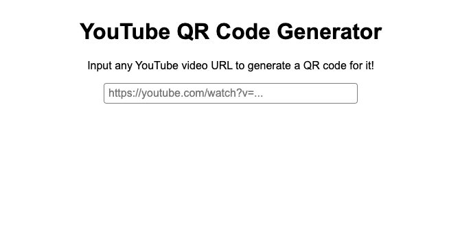

# YouTube QR Code Generator

A simple site that generates QR codes for YouTube videos. But... there might be a bit of a catch. ;)

This project was largely made with the end goal of fitting an entire website into a QR code. It's a QR code generator that fits inside of a QR code (sort of ;) ). When minified and converted to a data URI, the entire project does indeed fit inside of a QR code! Even so, many QR code scanners refuse to scan a QR code of this size. It is indeed readable, though. [This API](https://goqr.me/api/), for example, is one that reads it correctly.

For simplicity, the website is also available to try out [online](https://techpandapro.github.io/yt-qr-code-generator/).

Input a YouTube URL and get a QR code out!
